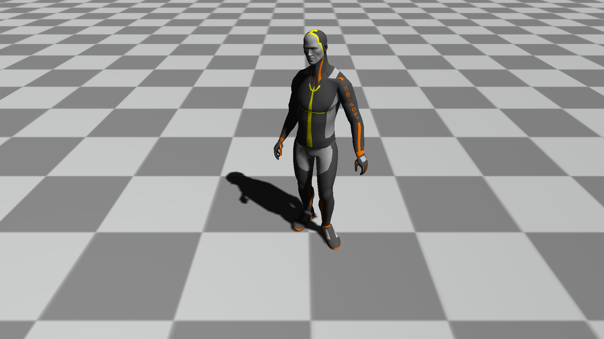

# Python Framework for Motion Data
```pyvmois``` is a framework for processing and visualizing motion data based on right-hand coordinate with y-axis as an up vector.


# How to use
```pyvmois``` has four main modules ```motion```, ```vis```, ```learning```, and ```ops```, and one additional auxiliary module ```utils```. Example codes are in [examples](examples/) and you can run the code you want through:
```
python examples/{script_to_run}.py
```

## Motion
We provide BVH parser for motion data and FBX parser for mesh data. Motion data in this framework is basically structred by hierarchy of Joint, Skeleton, Pose, and Motion, and you can see the structure [here](pymovis/motion/core.py). FBX motion parser will be updated soon.

## Visualization
In order to use visualization modules, these modules should be installed first.
```
PyOpenGL
PyOpenGL-accelerate
PyGLM
glfw
freetype-py
FBX SDK Python Binding
```
All modules except FBX SDK Python Binding can be installed by this command:
```
pip install -r requirements.txt
```

### Commands
* F1: Render the scene in GL_FILL mode.
* F2: Render the scene in GL_LINE mode.
* F5: Capture the screen in image and save in ```captures/yyyy-mm-dd/images```.
* F6: Capture the screen in video if entered once, and save in ```captures/yyyy-mm-dd/videos``` if entered again.

### Special Commands for MotionApp
```MotionApp``` is a class that inherits ```App``` and specialized to visualize motion data.

* Numbers (0~9): Moves the frame to play to (number * 10)% of the entire frames. For example, if the motion data consists of 1000 frames and you enter 5, the frame will be moved to frame 500.
* A: Switch the visualization of the axis.
* G: Switch the visualization of the grid.
* T: Switch the visualization of the frame.
* Spacebar: Play or pause the motion.
* []: Move a single frame to the past/future.
* Left/Right arrow: Move 10 frames to the past/future.

### Python FBX SDK Installation References on Windows
Reference:
[Link1](https://www.ralphminderhoud.com/blog/build-fbx-python-sdk-for-windows/)
[Link2](https://forums.autodesk.com/t5/fbx-forum/cannot-manage-to-compile-python-fbx-2020-0-1-vs2017-with-python/td-p/9270853)
[Link3](https://stackoverflow.com/questions/32054021/how-to-install-sip-pyqt-on-windows-7)


## Learning
```learning``` module provides several neural network models in PyTorch and linear regression models in SciPy.

## Operations
```ops``` provides several operations for dealing with motion data. Both NumPy ndarray and PyTorch Tensor are supported.

* ```mathops.py``` provides general mathematical operations.
* ```motionops.py``` provides manipulation functions for motion data (e.g. forward kinematics).
* ```rotation.py``` provides rotation operations and conversions.

## Utils
```utils``` provides several utility functions like multiprocessing and constants.

<!-- FBX C++ SDK & FBX Python Bindings & SIP
### How to install SIP and Python Bindings

NOTE 1: sip version 4.19.25 is not supported. Try sip version [4.19.3](https://sourceforge.net/projects/pyqt/) or earlier.

NOTE 2: No white spaces in all paths are allowed. Move and rename the path where those files without spaces.


### Setup the environment variable
We need to setup 3 environment variables, and here's the example:
* SIP_ROOT `C:\dev\sip-4.19.3`
* FBXSDK_ROOT `C:\dev\FBX\FBX_SDK\2020.2.1`
* FBXSDK_LIBS_64_FOLDER `C:\dev\FBX\FBX_SDK\2020.2.1\lib\vs2019\x64\release`

Then compile the scripts as follows:
```
cd SIP_ROOT
python configure.py
"C:\Qt\~~~~"
"C:\...\vcvarsall.bat" (If it doesn't work, try "~~~\vcvars64.bat")
nmake
nmake install
cd PythonBindings
python PythonBindings.py Python3_x64 buildsip
```

Then path_to_binding/version/build/Distrib/site-packages/fbx will be generated.
It would contain 3 files (fbx.pyd, FbxCommon.py, fbxsip.pyd), and you should move them to path_to_python/site_packages.

If interpreting PythonBindings.py fails, you can try changing the variable vcCompiler and vsCompiler to what you are using. -->

# Acknowledgements
The overall structure of the rendering modules is inspired by
[aOpenGL](https://github.com/ltepenguin/aOpenGL)
and [LearnOpenGL](https://learnopengl.com/)

BVH data processing and utility functions are inspired by
[fairmotion](https://github.com/facebookresearch/fairmotion),
[PFNN](https://github.com/sreyafrancis/PFNN),
and [LaFAN1](https://github.com/ubisoft/ubisoft-laforge-animation-dataset) repositories